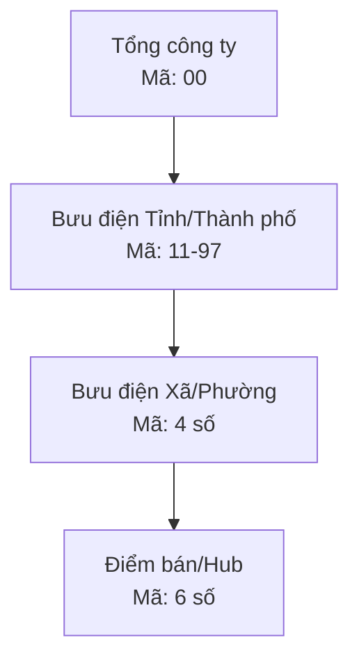
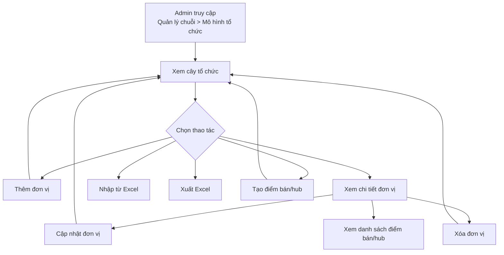

# Phân tích tài liệu: Mô hình tổ chức

Nguồn: `1. Mô hình tổ chức.docx`  
Dự án: Hệ thống ERP POS  
Phiên bản tài liệu gốc: SRS v1.0  
Ngày tài liệu gốc: 21/04/2026 - 22/04/2026

## 1. Mục tiêu phân hệ

Phân hệ **Mô hình tổ chức** thuộc module **Quản lý chuỗi** trong hệ thống ERP POS. Chức năng chính là cho phép Admin xây dựng và quản lý cấu trúc tổ chức dạng cây phân cấp.

Phạm vi tài liệu gốc tập trung vào nghiệp vụ và hướng dẫn sử dụng, chưa đi sâu vào thiết kế kỹ thuật, API, database, phân quyền chi tiết hoặc rule validate đầy đủ.

## 2. Đối tượng sử dụng

| Tiêu chí | Giá trị |
| --- | --- |
| Vai trò | Admin |
| Cấp thao tác | Tổng công ty |
| Đường dẫn truy cập | Menu > Quản lý chuỗi > Mô hình tổ chức |

## 3. Mô hình phân cấp tổ chức

Hệ thống quản lý cây tổ chức gồm 4 cấp:

| Cấp | Tên cấp | Quy tắc mã | Ghi chú |
| --- | --- | --- | --- |
| 1 | Tổng công ty | 2 số, mặc định `00` | Cấp cao nhất |
| 2 | Bưu điện Tỉnh/Thành phố | 2 số, từ `11` đến `97` | Trực thuộc Tổng công ty |
| 3 | Bưu điện Xã/Phường | 4 số | Trực thuộc Bưu điện Tỉnh/Thành phố |
| 4 | Điểm bán/Hub | 6 số | Trực thuộc cây tổ chức |

Sơ đồ tổng quát:

## 4. Nhóm chức năng

| STT | Nhóm chức năng | Mô tả |
| --- | --- | --- |
| 1 | Quản lý đơn vị tổ chức | Thêm mới, xem danh sách, xem chi tiết, chỉnh sửa, xóa đơn vị, nhập Excel, xuất Excel theo cây 4 cấp |
| 2 | Quản lý điểm bán/hub | Tạo, xem chi tiết, chỉnh sửa, xóa điểm bán/hub tại cây thư mục |

## 5. Luồng nghiệp vụ tổng quát

## 6. Chi tiết chức năng

### 6.1. Thêm đơn vị - Cách 1

Admin thêm đơn vị từ màn hình chính **Mô hình tổ chức**.

Quy trình:

1. Truy cập `Menu > Quản lý chuỗi > Mô hình tổ chức`.
2. Chọn thao tác **Thêm mới đơn vị**.
3. Nhập các trường bắt buộc:
   - Mã đơn vị.
   - Tên đơn vị.
   - Đơn vị cha.
4. Bấm **Xác nhận** để hoàn tất.

Validate cần có:

| Trường | Bắt buộc | Rule |
| --- | --- | --- |
| Mã đơn vị | Có | Theo cấp: `00`, `11-97`, 4 số, 6 số |
| Tên đơn vị | Có | Không được để trống |
| Đơn vị cha | Có | Bắt buộc nếu tạo đơn vị con |

### 6.2. Thêm đơn vị - Cách 2

Admin thêm nhanh đơn vị con từ cây tổ chức bên trái.

Quy trình:

1. Tại cây tổ chức, hover vào một đơn vị.
2. Click icon/button thêm mới.
3. Màn hình thêm đơn vị hiện sẵn **Đơn vị cha** theo đơn vị vừa chọn.
4. Admin nhập **Mã đơn vị** và **Tên đơn vị**.
5. Bấm **Xác nhận**.

Ghi chú phân tích:

- Cách này giúp giảm lỗi chọn sai đơn vị cha.
- Cần khóa hoặc giới hạn danh sách cấp con được phép tạo theo cấp hiện tại.
- Nếu đơn vị đang ở cấp 4 là Điểm bán/Hub thì không nên cho tạo tiếp cấp con.

### 6.3. Xem danh sách đơn vị phân cấp

Sau khi thêm mới thành công, đơn vị hiển thị ở menu bên trái theo cây phân cấp.

Cần làm rõ khi thiết kế:

| Nội dung | Đề xuất |
| --- | --- |
| Thứ tự sắp xếp | Sắp xếp theo mã đơn vị hoặc tên đơn vị, cần thống nhất |
| Trạng thái rỗng | Cần có empty state khi chưa có dữ liệu |
| Tải dữ liệu cây | Cần quyết định load toàn bộ cây hay lazy-load theo cấp |
| Tìm kiếm | Tài liệu gốc chưa đề cập, nên cần xác nhận có cần search/filter không |

### 6.4. Xem chi tiết đơn vị

Admin click vào một đơn vị bất kỳ trong cây tổ chức để xem chi tiết.

Từ màn hình chi tiết, Admin có thể:

- Chỉnh sửa đơn vị.
- Xóa đơn vị.
- Tạo điểm bán/hub.
- Xem danh sách điểm bán/hub.

Thông tin chi tiết tối thiểu nên hiển thị:

| Nhóm thông tin | Trường |
| --- | --- |
| Định danh | Mã đơn vị, Tên đơn vị |
| Quan hệ cây | Đơn vị cha, cấp đơn vị |
| Trạng thái/cấu hình | Chưa nêu trong tài liệu gốc |
| Thao tác | Cập nhật, Xóa, Tạo điểm bán, Xem danh sách điểm bán/hub |

### 6.5. Chỉnh sửa đơn vị

Quy trình:

1. Tại màn hình chi tiết đơn vị, Admin bấm **Cập nhật**.
2. Hệ thống hiện form cho phép sửa:
   - Mã đơn vị.
   - Tên đơn vị.
   - Đơn vị cha.
3. Admin bấm **Xác nhận**.

Điểm cần kiểm soát:

| Rủi ro | Rule đề xuất |
| --- | --- |
| Đổi mã sai cấp | Mã mới phải đúng rule của cấp hiện tại |
| Đổi đơn vị cha gây vòng lặp | Không cho chọn chính nó hoặc con/cháu của nó làm đơn vị cha |
| Đổi đơn vị cha làm sai cấp | Đơn vị cha mới phải ở cấp trên liền kề |
| Trùng mã đơn vị | Cần quy định mã là unique toàn hệ thống hay unique theo cấp/cha |

### 6.6. Xóa đơn vị

Admin bấm icon/button **Xóa** tại màn hình chi tiết. Hệ thống hiện popup confirm:

> Hành động này sẽ không thể hoàn tác, bạn có chắc chắn muốn xóa?

Ảnh hưởng khi xóa:

| Cấp bị xóa | Dữ liệu bị ảnh hưởng |
| --- | --- |
| Tổng công ty | Xóa toàn bộ cấp Tỉnh/Xã/Điểm bán bên dưới |
| Bưu điện Tỉnh | Xóa toàn bộ cấp Xã và Điểm bán thuộc Tỉnh đó |
| Bưu điện Xã | Xóa toàn bộ Điểm bán thuộc Xã đó |
| Điểm bán/Hub | Chỉ xóa Điểm bán/Hub được chỉ định |

Điểm cần làm rõ:

- Xóa là hard delete hay soft delete?
- Có cần chặn xóa nếu đơn vị/điểm bán đã phát sinh giao dịch không?
- Có cần log audit người xóa, thời gian xóa, dữ liệu trước khi xóa không?
- Popup cần hiện số lượng đơn vị/điểm bán sẽ bị xóa để tránh thao tác nhầm.

### 6.7. Nhập từ Excel

Mục đích: nhập hàng loạt đơn vị/điểm bán/hub vào cây tổ chức.

Quy trình:

1. Tại màn hình **Mô hình tổ chức**, Admin bấm **Nhập từ Excel**.
2. Admin tải file mẫu.
3. Admin điền thông tin vào file mẫu.
4. Admin upload file Excel lên hệ thống.
5. Hệ thống validate và import dữ liệu.

Yêu cầu nên bổ sung:

| Nhóm | Nội dung cần có |
| --- | --- |
| File mẫu | Định dạng cột, ví dụ dữ liệu, rule bắt buộc |
| Validate | Mã đúng định dạng, không trùng, đơn vị cha tồn tại, cấp hợp lệ |
| Kết quả import | Số dòng thành công, số dòng lỗi, file lỗi để tải về |
| Transaction | Cần quyết định lỗi 1 dòng thì rollback toàn bộ hay bỏ qua dòng lỗi |

### 6.8. Xuất Excel

Admin có thể xuất danh sách tổ chức/điểm bán ra Excel.

Cần làm rõ:

- Xuất toàn bộ cây hay xuất theo node đang chọn?
- File xuất có bao gồm Điểm bán/Hub không?
- Thứ tự cột và format file có trùng với file mẫu import không?
- Có cần phân quyền dữ liệu theo cấp Admin không?

### 6.9. Tạo điểm bán/hub

Quy trình:

1. Tại màn hình chi tiết đơn vị, Admin bấm **Tạo điểm bán**.
2. Nhập thông tin điểm bán/hub.
3. Bấm **Xác nhận**.

Trường thông tin:

| Trường | Bắt buộc | Ghi chú |
| --- | --- | --- |
| Phân loại | Có | Chọn 1 trong 3 loại: Pos mini, Pos plus, Hub |
| Tên điểm bán | Có | Tên điểm bán/hub |
| Cửa hàng mẫu | Có | Tài liệu gốc ghi bắt buộc |
| Bưu điện tỉnh/thành phố | Có | Đơn vị quản lý cấp tỉnh |
| Bưu điện xã/phường | Có | Đơn vị quản lý cấp xã |
| Tỉnh/thành phố | Có | Địa chỉ hành chính |
| Xã/phường | Có | Địa chỉ hành chính |
| Địa chỉ | Không nêu rõ | Địa chỉ chi tiết |
| Là cửa hàng mẫu | Không nêu rõ | Dạng checkbox/flag |

Quy tắc phân loại trong tài liệu gốc:

| Phân loại | Mô tả |
| --- | --- |
| Pos mini | Điểm bán thuộc BĐT, BĐX |
| Pos plus | Điểm bán thuộc TCT |
| Hub | TCT -> BĐT -> BĐX |

Điểm cần làm rõ:

- Điểm bán/Hub có được xem là cấp 4 trong cây tổ chức hay là entity riêng liên kết với đơn vị?
- Trường **Cửa hàng mẫu** và **Là cửa hàng mẫu** khác nhau như thế nào?
- Nếu chọn Pos plus thuộc TCT thì có bắt buộc Bưu điện tỉnh/xã không?
- Mã điểm bán 6 số được nhập tại form này hay sinh từ hệ thống?

### 6.10. Xem danh sách điểm bán/hub

Từ màn hình chi tiết đơn vị, Admin bấm link **Xem danh sách** điểm bán/hub. Hệ thống chuyển sang module **Quản lý điểm bán/hub** và hiển thị danh sách.

Tại danh sách, Admin có thể chọn **Chi tiết** để xem thông tin điểm bán/hub, sau đó chỉnh sửa hoặc xóa.

Cần làm rõ:

- Danh sách được filter theo đơn vị đang chọn hay hiển thị toàn bộ?
- Khi chuyển module có cần truyền context node đang chọn không?
- Quyền chỉnh sửa/xóa điểm bán tại module Quản lý điểm bán/hub có đồng bộ với quyền tại Mô hình tổ chức không?

## 7. Business rules tổng hợp

| Mã rule | Nội dung |
| --- | --- |
| BR-01 | Cây tổ chức gồm tối đa 4 cấp: TCT, BĐT, BĐX, Điểm bán/Hub |
| BR-02 | Tổng công ty có mã `00` |
| BR-03 | Bưu điện Tỉnh/Thành phố có mã 2 số trong khoảng `11-97` |
| BR-04 | Bưu điện Xã/Phường có mã 4 số |
| BR-05 | Điểm bán/Hub có mã 6 số |
| BR-06 | Thêm đơn vị con bắt buộc có đơn vị cha |
| BR-07 | Xóa đơn vị cha sẽ xóa toàn bộ các cấp con bên dưới |
| BR-08 | Admin cấp Tổng công ty là đối tượng thao tác chính |
| BR-09 | Import Excel dùng để tạo hàng loạt đơn vị/điểm bán/hub |
| BR-10 | Điểm bán/hub có thể được tạo từ màn hình chi tiết đơn vị |

## 8. Checklist màn hình

| Màn hình | Chức năng cần có |
| --- | --- |
| Mô hình tổ chức | Hiện cây tổ chức, thêm đơn vị, nhập Excel, xuất Excel |
| Thêm đơn vị | Nhập mã, tên, đơn vị cha, xác nhận/hủy |
| Chi tiết đơn vị | Hiện thông tin đơn vị, cập nhật, xóa, tạo điểm bán, xem danh sách điểm bán |
| Cập nhật đơn vị | Sửa mã, tên, đơn vị cha |
| Xóa đơn vị | Popup confirm và cảnh báo ảnh hưởng |
| Nhập Excel | Tải file mẫu, upload file, hiện kết quả import |
| Xuất Excel | Tải file danh sách |
| Thêm điểm bán/hub | Nhập phân loại, tên, địa chỉ, đơn vị liên quan, cửa hàng mẫu |
| Danh sách điểm bán/hub | Xem danh sách, xem chi tiết, chỉnh sửa, xóa |

## 9. Checklist kiểm thử

### Thêm đơn vị

- [ ] Thêm Tổng công ty với mã `00`.
- [ ] Thêm Bưu điện Tỉnh với mã hợp lệ `11-97`.
- [ ] Không cho thêm Bưu điện Tỉnh với mã ngoài khoảng `11-97`.
- [ ] Thêm Bưu điện Xã với mã 4 số.
- [ ] Không cho thêm Bưu điện Xã với mã khác 4 số.
- [ ] Thêm Điểm bán/Hub với mã 6 số.
- [ ] Không cho thêm trùng mã nếu rule unique được áp dụng.
- [ ] Thêm nhanh từ cây tự động fill đúng Đơn vị cha.

### Xem và cập nhật

- [ ] Click node trên cây hiển thị đúng chi tiết.
- [ ] Cập nhật tên đơn vị thành công.
- [ ] Cập nhật mã đơn vị phải validate lại đúng định dạng.
- [ ] Không cho chọn đơn vị cha sai cấp.
- [ ] Không cho tạo vòng lặp cha-con khi đổi đơn vị cha.

### Xóa

- [ ] Xóa Điểm bán/Hub chỉ xóa node được chọn.
- [ ] Xóa Bưu điện Xã xóa các Điểm bán/Hub con.
- [ ] Xóa Bưu điện Tỉnh xóa các Xã và Điểm bán/Hub con.
- [ ] Xóa Tổng công ty xóa toàn bộ cây bên dưới.
- [ ] Bấm Hủy ở popup thì không xóa dữ liệu.
- [ ] Hệ thống cảnh báo rõ ràng trước khi xóa cascade.

### Excel

- [ ] Tải được file mẫu.
- [ ] Import file hợp lệ thành công.
- [ ] Import file sai định dạng hiển thị lỗi rõ ràng.
- [ ] Import file có mã trùng hiển thị lỗi.
- [ ] Import file có đơn vị cha không tồn tại hiển thị lỗi.
- [ ] Xuất Excel thành công.
- [ ] File xuất đúng cấu trúc và dữ liệu trên hệ thống.

### Điểm bán/Hub

- [ ] Tạo Pos mini hợp lệ.
- [ ] Tạo Pos plus hợp lệ.
- [ ] Tạo Hub hợp lệ.
- [ ] Validate các trường bắt buộc khi tạo điểm bán/hub.
- [ ] Xem danh sách điểm bán/hub từ chi tiết đơn vị.
- [ ] Chuyển sang module Quản lý điểm bán/hub đúng context.
- [ ] Xem chi tiết, chỉnh sửa, xóa điểm bán/hub thành công.

## 10. Điểm chưa rõ/cần xác nhận với BA/PO

| STT | Câu hỏi |
| --- | --- |
| 1 | Mã đơn vị có unique toàn hệ thống hay chỉ unique trong cùng cấp/cùng đơn vị cha? |
| 2 | Điểm bán/Hub là node cấp 4 của cây tổ chức hay là entity riêng được gắn vào đơn vị? |
| 3 | Khi xóa có hard delete hay soft delete? Có cần chặn xóa nếu đã phát sinh giao dịch? |
| 4 | Import Excel nếu có lỗi thì rollback toàn bộ file hay import các dòng hợp lệ? |
| 5 | File mẫu Excel gồm những cột nào và format chuẩn là gì? |
| 6 | Pos mini, Pos plus, Hub ảnh hưởng thế nào đến các trường bắt buộc? |
| 7 | Trường "Cửa hàng mẫu" và checkbox "Là cửa hàng mẫu" khác nhau như thế nào? |
| 8 | Admin cấp Tổng công ty có quản lý toàn bộ dữ liệu hay có giới hạn theo khu vực? |
| 9 | Có cần lịch sử thay đổi/audit log cho thêm, sửa, xóa, import không? |
| 10 | Có cần tìm kiếm, filter, sắp xếp cây tổ chức không? |

## 11. Đề xuất backlog triển khai

| Ưu tiên | Hạng mục |
| --- | --- |
| P0 | CRUD đơn vị tổ chức theo cây 4 cấp |
| P0 | Validate mã đơn vị theo cấp |
| P0 | Xem cây và xem chi tiết đơn vị |
| P0 | Xóa cascade có popup cảnh báo |
| P0 | Tạo điểm bán/hub từ chi tiết đơn vị |
| P1 | Import Excel kèm validate và báo cáo lỗi |
| P1 | Xuất Excel |
| P1 | Chuyển context sang danh sách điểm bán/hub |
| P2 | Search/filter cây tổ chức |
| P2 | Audit log thao tác |
| P2 | Soft delete và khôi phục dữ liệu nếu nghiệp vụ yêu cầu |

## 12. Kết luận

Tài liệu gốc đã mô tả được luồng sử dụng chính của phân hệ **Mô hình tổ chức**, nhưng còn thiếu một số rule quan trọng cho giai đoạn thiết kế và phát triển: tính duy nhất của mã, hành vi xóa, cấu trúc import Excel, quan hệ thực tế giữa Điểm bán/Hub và cây tổ chức, cũng như phân quyền/audit.

Trước khi dev, nên chốt các câu hỏi ở mục **10. Điểm chưa rõ/cần xác nhận với BA/PO** để tránh sai logic dữ liệu và hành vi xóa/import.
